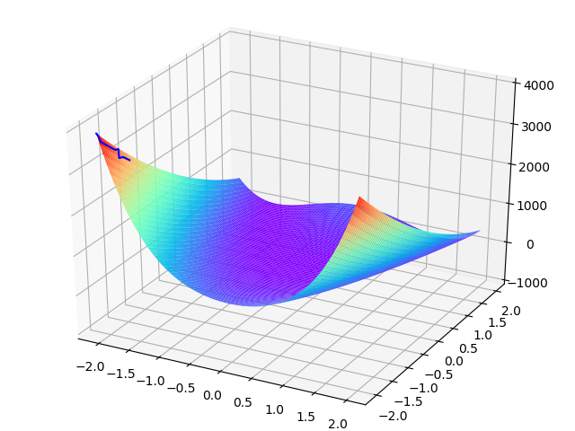

# AI Fall 2022 Labs

## Lab1-2 A\* search Algorithm

## Lab3 Genetic Algorithm

Find maximum of Rosenbrock function with $x1$, $x2$ are both in range of $[-2.048, 2.048]$ using genetic algorithm

$(x1, x2) = (-2.048, -2.048)$

## Lab4 Particle Swarm optimization

Find maximum of the following function using PSO

- $30x - y$
- $30y - x$
- $x^2 - y/2$
- $20y^2 - 500x$

results:

<table>
    <tr>
        <td></td>
        <td></td>
    </tr>
    <tr>
        <td></td>
        <td></td>
    </tr>
</table>

## Lab5 KNN algorithm